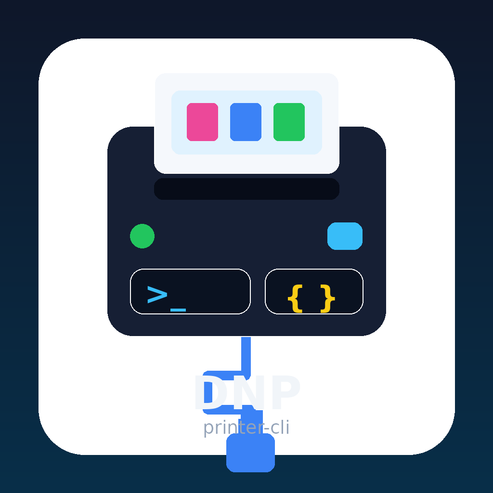

# DNP Printer CLI

[](https://github.com/)
[](https://www.python.org/)
[](https://dotnet.microsoft.com/)
[](./LICENSE)
[](https://github.com/)

**Jump to:** [English](#english) | [Deutsch](#deutsch)

<p align="center">
  
</p>

<p align="center">
  <strong>CLI for querying DNP photo printers over USB, available in Python and C#.</strong>
</p>

---

## English

### Overview

**DNP Printer CLI** is a command-line tool for querying **DNP photo printers directly over USB** without requiring **Hot Folder Print**.

The project currently focuses on **Windows** with direct USB / printer-device access and is structured from the beginning so that a **Linux backend** can be added later **without changing the CLI interface**.

The repository includes:

- a **Python implementation**
- a **C# / .NET implementation**, which can also be published as a **standalone Windows EXE**

Both variants are designed around the same idea:

- direct printer communication
- text or JSON output
- clear separation between protocol / parser logic and platform-specific transport logic

### Features

- Query DNP printers directly over USB
- No Hot Folder workflow required
- Text output for terminal use
- JSON output for scripts, APIs, and server integrations
- Detect supported printers by known VID/PID combinations
- Read printer information such as:
  - printer status
  - remaining prints
  - media type
  - free buffer
- Architecture prepared for future Linux support

### Supported scope

The project is intended for **DNP photo printers** covered by the built-in **VID/PID catalog**.
It is **not limited to the QW410**.
If a supported DNP model uses a known VID/PID pair, it can be detected and queried by the tool.

### Project structure

#### Python

- `main_dnp.py` — CLI entry point
- `common_dnp.py` — shared models, packet codec, parsers, protocol client
- `windows_dnp.py` — Windows-specific device detection and USB/device-path transport
- `linux_dnp.py` — Linux transport placeholder / future backend structure

#### C# / .NET

- `Cli` — argument parsing and output
- `Core` — models, commands, parsers, interfaces
- `Transport.Windows` — Windows-specific USB / printer access
- `Transport.Linux` — planned Linux transport backend

### Commands

Typical commands include:

- `detect`
- `info`
- `probe`
- `status`
- `remaining`
- `media`
- `free-buffer`

Most commands support plain text output and JSON output.

### Example usage

#### Python

```bash
python main_dnp.py detect
python main_dnp.py info --json
python main_dnp.py status --device "\\?\usb#vid_1452&pid_9201#..." --json
```

#### C# / .NET

```bash
dnp_info.exe detect
dnp_info.exe info --json
dnp_info.exe status --device "\\?\usb#vid_1452&pid_9201#..." --json
```

### Build

#### Python

No special build step is required.
Run the scripts directly with Python on Windows.

#### C# / .NET

You can build and publish the CLI as a Windows executable with `dotnet publish`, for example as a self-contained single-file EXE.

### Design goal

The main design goal is to keep the **CLI interface stable** while allowing the **transport backend** to evolve.

That means:

- protocol handling should stay reusable
- parsing logic should stay reusable
- Windows-specific access should stay isolated
- a future Linux implementation should be pluggable without changing how users call the CLI

### Use cases

- booth / kiosk software
- printer monitoring
- automated printer checks
- local service wrappers and HTTP APIs
- integrations that need machine-readable JSON output

---

## Deutsch

### Überblick

**DNP Printer CLI** ist ein Kommandozeilen-Tool, um **DNP-Fotodrucker direkt über USB** abzufragen, **ohne Hot Folder Print** zu benötigen.

Das Projekt startet aktuell mit einem **Windows-Fokus** und direktem USB-/Druckerzugriff. Die Architektur ist aber von Anfang an so aufgebaut, dass später ein **Linux-Backend** ergänzt werden kann, **ohne die CLI-Schnittstelle zu ändern**.

Das Repository enthält:

- eine **Python-Implementierung**
- eine **C# / .NET-Implementierung**, die auch als **eigenständige Windows-EXE** veröffentlicht werden kann

Beide Varianten folgen demselben Grundprinzip:

- direkte Kommunikation mit dem Drucker
- Ausgabe als Text oder JSON
- klare Trennung zwischen Protokoll-/Parserlogik und plattformspezifischer Transportlogik

### Features

- Direkte Abfrage von DNP-Druckern über USB
- Kein Hot-Folder-Workflow erforderlich
- Textausgabe für die Konsole
- JSON-Ausgabe für Skripte, APIs und Server-Integrationen
- Erkennung unterstützter Drucker über bekannte VID/PID-Kombinationen
- Auslesen von Druckerinformationen wie:
  - Druckerstatus
  - verbleibende Drucke
  - Medientyp
  - freier Buffer
- Architektur vorbereitet für spätere Linux-Unterstützung

### Unterstützter Umfang

Das Projekt ist für **DNP-Fotodrucker** gedacht, die im eingebauten **VID/PID-Katalog** enthalten sind.
Es ist **nicht auf den QW410 beschränkt**.
Wenn ein unterstütztes DNP-Modell ein bekanntes VID/PID-Paar verwendet, kann es vom Tool erkannt und abgefragt werden.

### Projektstruktur

#### Python

- `main_dnp.py` — CLI-Einstiegspunkt
- `common_dnp.py` — gemeinsame Modelle, Paket-Codec, Parser, Protokoll-Client
- `windows_dnp.py` — Windows-spezifische Geräteerkennung und USB-/Device-Path-Transport
- `linux_dnp.py` — Linux-Platzhalter / Struktur für das spätere Backend

#### C# / .NET

- `Cli` — Argumente und Ausgabe
- `Core` — Modelle, Kommandos, Parser, Interfaces
- `Transport.Windows` — Windows-spezifischer USB-/Druckerzugriff
- `Transport.Linux` — geplantes Linux-Backend

### Kommandos

Typische Kommandos sind:

- `detect`
- `info`
- `probe`
- `status`
- `remaining`
- `media`
- `free-buffer`

Die meisten Kommandos unterstützen sowohl Klartext- als auch JSON-Ausgabe.

### Beispielnutzung

#### Python

```bash
python main_dnp.py detect
python main_dnp.py info --json
python main_dnp.py status --device "\\?\usb#vid_1452&pid_9201#..." --json
```

#### C# / .NET

```bash
dnp_info.exe detect
dnp_info.exe info --json
dnp_info.exe status --device "\\?\usb#vid_1452&pid_9201#..." --json
```

### Build

#### Python

Kein spezieller Build-Schritt nötig.
Die Skripte können unter Windows direkt mit Python ausgeführt werden.

#### C# / .NET

Die CLI kann mit `dotnet publish` als Windows-Executable gebaut und veröffentlicht werden, zum Beispiel als selbstenthaltende Single-File-EXE.

### Architekturziel

Das Hauptziel ist, die **CLI-Schnittstelle stabil** zu halten, während sich das **Transport-Backend** weiterentwickeln kann.

Das bedeutet:

- Protokolllogik soll wiederverwendbar bleiben
- Parserlogik soll wiederverwendbar bleiben
- Windows-spezifischer Zugriff soll isoliert bleiben
- eine spätere Linux-Implementierung soll ergänzbar sein, ohne die CLI-Aufrufe zu verändern

### Anwendungsfälle

- Booth- / Kiosk-Software
- Drucker-Monitoring
- automatisierte Druckerprüfungen
- lokale Service-Wrapper und HTTP-APIs
- Integrationen, die maschinenlesbare JSON-Ausgabe benötigen

### License

This project is licensed under the **GNU Affero General Public License v3.0 (AGPL-3.0)**.

**Copyright (c) 2026 Andreas Rottmann**

See the [LICENSE](./LICENSE) file for details.

### Lizenz

Dieses Projekt ist unter der **GNU Affero General Public License v3.0 (AGPL-3.0)** lizenziert.

**Copyright (c) 2026 Andreas Rottmann**

Details stehen in der Datei [LICENSE](./LICENSE).